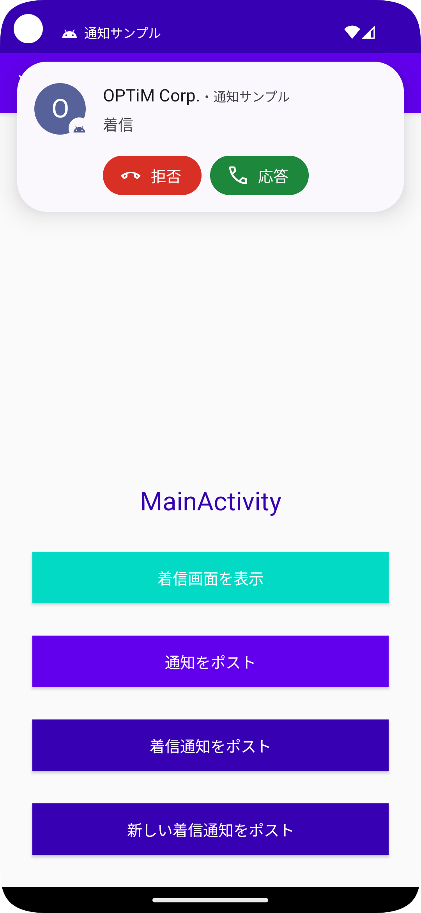

# techblog_android_notification_sample

OPTiM TECH BLOG 用の通知サンプルアプリです。

## 関連記事一覧

* [2020/12/25](https://tech-blog.optim.co.jp/entry/2020/12/25/100000) Androidで着信通知を実装してみよう
* [2021/01/15](https://tech-blog.optim.co.jp/entry/2021/01/15/130000) Androidの着信通知の仕様を調査してみた
* [2022/10/11](https://tech-blog.optim.co.jp/entry/2022/10/11/100000) Android 13 までの通知関連の仕様とその実装方法を理解する

## スクリーンショット

※ 使用端末: Android Emulator (Pixel 4a, API33)

  

## 開発環境

* Android Studio Dolphin | 2021.3.1

## ライセンス

* [MIT License](./LICENSE)
